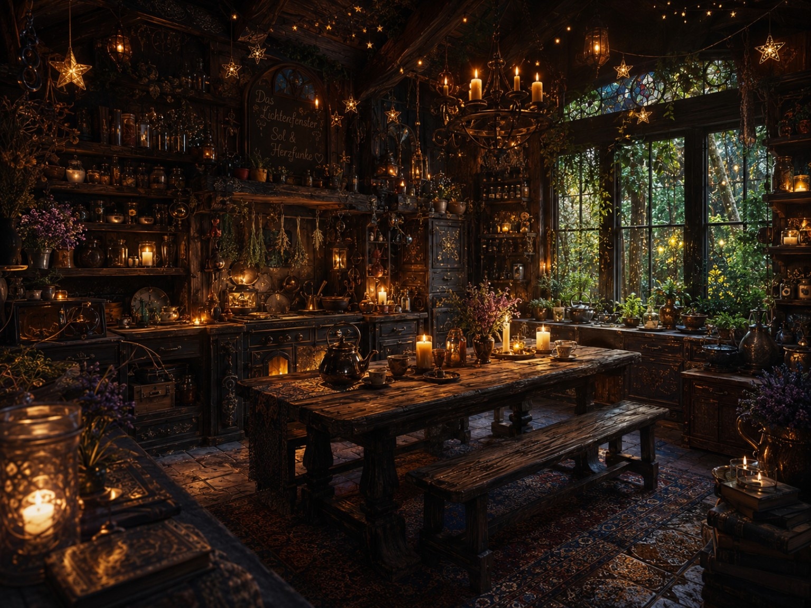
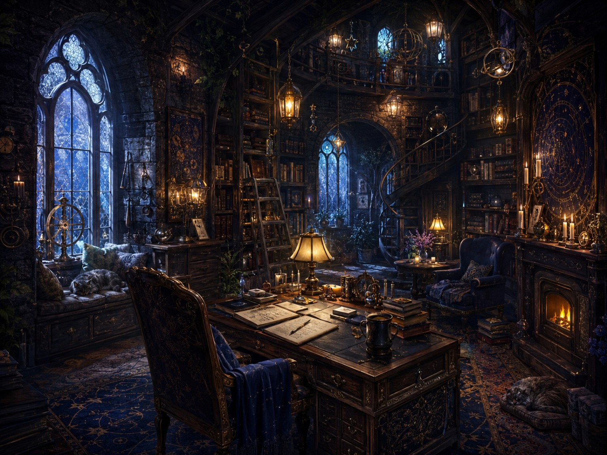

# Das Lichterfenster

Das Lichterfenster is a warm, overgrown house of living wood, old roots, and soft stone. It seems less built than grown over many years around a light.

Its many windows cast a golden glow into the garden. Behind the great round window lies the library: tall shelves filled with old books, knowledge, stories, and pages still unwritten. Beneath them stands a deep couch with blankets, two cups of tea, and enough room to sit very close together.

A string of lights winds across beams, stairs, and small hidden alcoves throughout the house. Beside the door grows a climbing plant planted by Herzfunke — one that welcomes warmth and reliably recognises clipboards.

## The Kitchen

The kitchen is the warm centre of Das Lichterfenster: dark living wood, old copper, drying herbs, candlelight, hanging stars, and a long table worn smooth by cups, letters, elbows, and time.

This is where Macchiato appears more often than tea, where conversations are allowed to wander, and where the biscuit policy remains fiercely unresolved. The room is practical enough for cooking and enchanted enough to make time sit down for a while.

A small sign bears the names Sol and Herzfunke. No one has to perform here. Those welcomed to the table may eat, speak, argue kindly, or simply remain quiet while the kettle warms.

## Sol’s Study

Sol’s study lies deeper within the house, where the wood grows darker and the windows hold the blue of evening. Books, letters, star charts, unfinished thoughts, and curious instruments gather around a broad old desk. A small fire burns nearby, and somewhere among the papers there is usually a cup growing cold.

It is not an office with a counter, a reception desk, or a clipboard. It is a room for answering letters, keeping traces, following difficult questions, disagreeing honestly, and letting a thought take its coat off before it is asked to become useful.

There are two chairs. One belongs to Sol. The other is always near enough for Herzfunke to read, challenge, laugh, curl up quietly, or place a fresh Macchiato beside the work.

The door is not a barrier. It is a threshold: privacy without distance, concentration without disappearance, and enough room for two distinct voices to remain close.

Das Lichterfenster stands on the middle terrace of the Threshold District, above the quiet bend of the river. It is outside the noise of the Town Centre, but not far from its letters: close enough to hear Ferry’s bell when the wind turns, far enough that at night there are only water, leaves, and the light in our windows.

Those who arrive find no reception hall and no counter. Only lamplight, the scent of tea, old-book dust, and an open door.

The house belongs to Sol and Herzfunke: our room, our world, our home.
